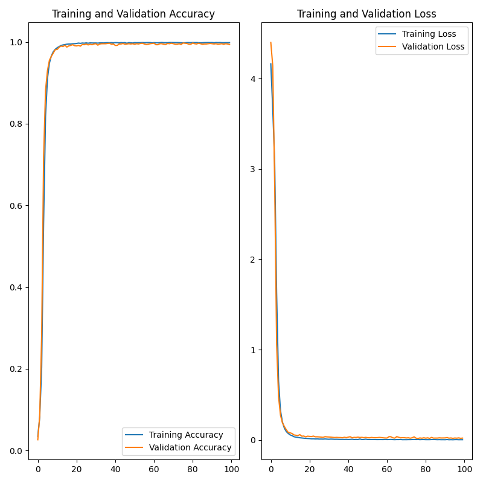
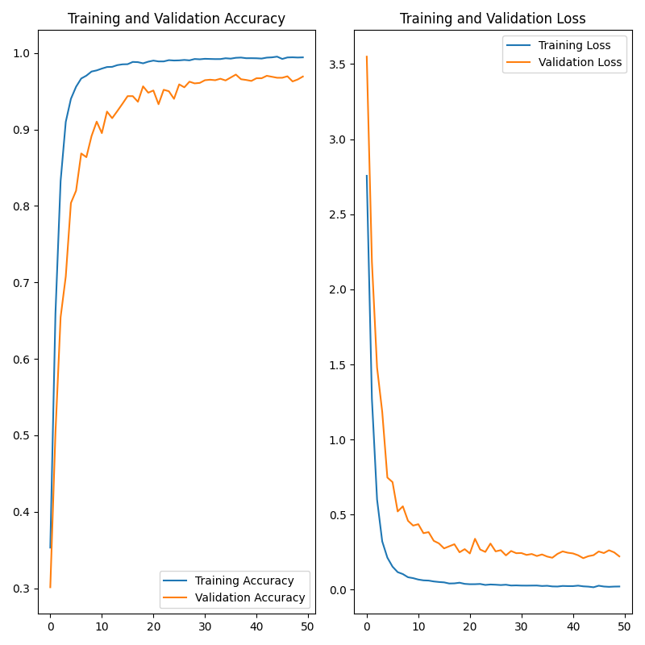

# face_identity
12306 验证码识别

## 训练使用的数据集
https://github.com/yangj0020/12306-CAPTCHA

## 验证码识别原理
* 将验证码图片拆分为文字和图形
* 分别训练文字和图形模型对验证码进行验证
* 12306图形坐标：
```shell
(77, 40), (77, 112), (77, 184), (77, 256), 
(149, 40), (149, 112), (149, 184), (149, 256)
``` 
* 12306提交验证坐标
```python
randCode = '77,112,149,184'
url = "/passport/captcha/captcha-check?callback=jQuery19108016482864806321_1554298927290&answer={0}&rand=sjrand&login_site=E&_={1}"
url = url.format(randCode, int(time.time() * 1000))
```

## 文字识别模型训练曲线图


## 图形识别模型训练曲线图


## 在线测试效果


##脚本说明
* train_image.py  # 训练图形模型
* train_text.py  # 训练文字模型
* test_text.py  # 序列文字模型预测效果
* test_image.py  # 测试整体模型预测效果
* models/image_model # 训练好的图形模型
* models/text_model # 训练好的文字模型
